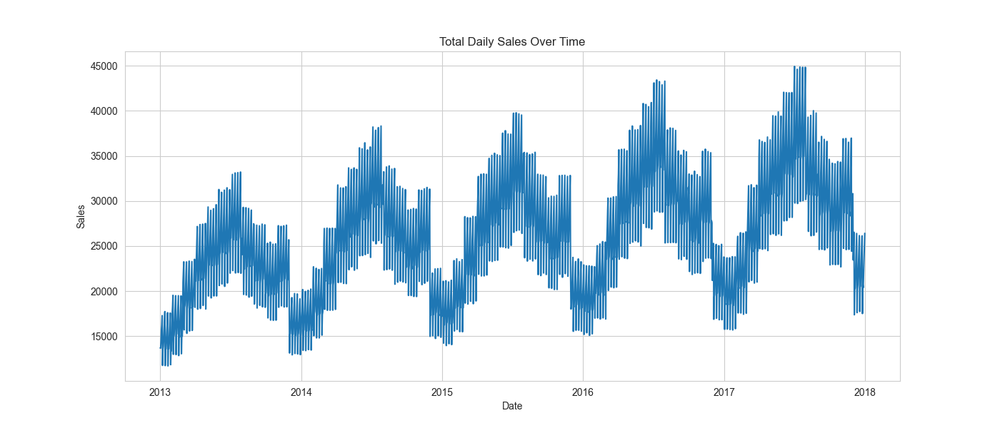
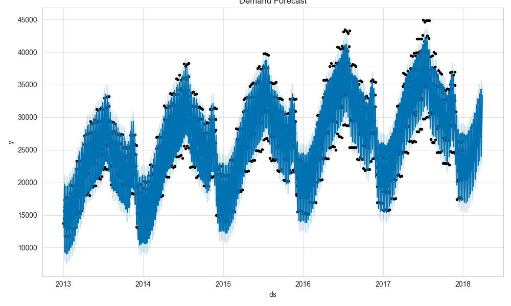
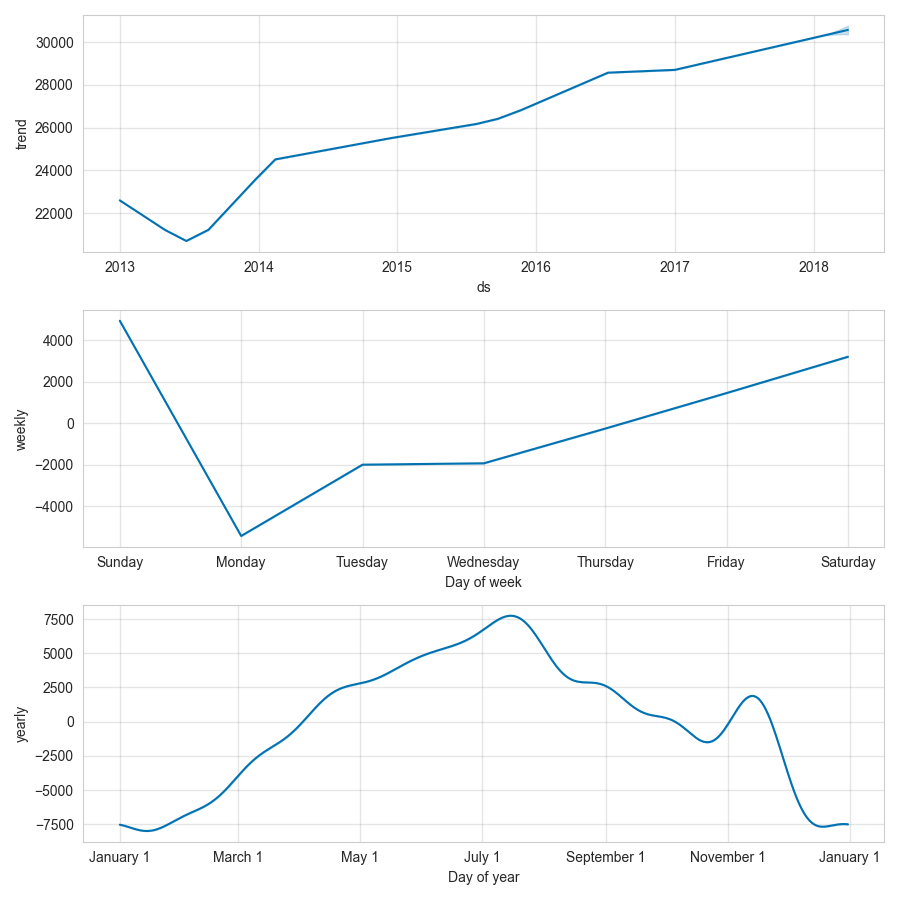

# Demand Forecasting for Retail Operations

## Overview
This project focuses on forecasting retail demand using historical sales data to support inventory planning, operational efficiency, and data-driven decision-making.

Using time series analysis and machine learning (Prophet), the project identifies trends and seasonal patterns to generate reliable demand forecasts.

---

## Business Problem

Retail businesses need accurate demand forecasts to:

- Avoid stockouts and overstock
- Optimize inventory levels
- Improve supply chain planning
- Anticipate demand fluctuations

This project simulates a real-world scenario where historical sales data is used to predict future demand.

---

## Dataset

The dataset contains historical daily sales across multiple stores and items.

Main fields:

- `date`
- `store`
- `item`
- `sales`

The data was aggregated at a daily level to build a time series forecasting model.

---

## Exploratory Analysis

### Total Daily Sales



The time series shows stable long-term behavior with visible patterns over time.

---

## Forecasting Model

The model was built using **Facebook Prophet**, which is designed for time series forecasting with strong seasonality and trend detection.

### Demand Forecast



---

### Model Components



The model captures:

- **Trend**: overall direction of demand over time  
- **Weekly seasonality**: recurring patterns across days of the week  
- **Yearly seasonality**: long-term fluctuations  

---

## Key Insights

- Demand shows **consistent patterns over time**
- Clear **seasonal behavior** is present
- Forecast provides a reliable baseline for the next 90 days
- The model can be extended to:
  - Store-level forecasting
  - Item-level forecasting
  - Demand segmentation

---

## Business Impact

This type of model can be used to:

- Improve inventory planning
- Optimize supply chain decisions
- Support demand-driven operations
- Reduce operational costs

---

## Tech Stack

- Python
- Pandas
- Prophet
- Matplotlib / Seaborn
- SQL (data preparation)
- Power BI (planned)

---

## Project Structure
```text
demand-forecasting-retail/
├── README.md
├── requirements.txt
├── data/
│   ├── raw/
│   └── processed/
├── notebooks/
├── src/
├── sql/
├── dashboard/
├── images/
└── docs/
```

## Next Steps

- Forecast by store and product
- Evaluate model performance (MAE, RMSE)
- Build Power BI dashboard
- Deploy forecasting pipeline

---

## Author

Alfredo Kaleniuszka  
Senior Data Analyst / Analytics Engineer  

- LinkedIn: https://www.linkedin.com/in/alfredo-kaleniuszka  
- GitHub: https://github.com/akaleniuszka  
- Website: https://alfredokaleniuszka.com